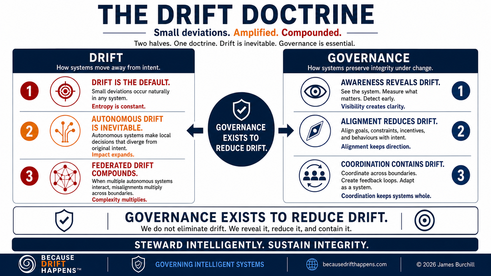
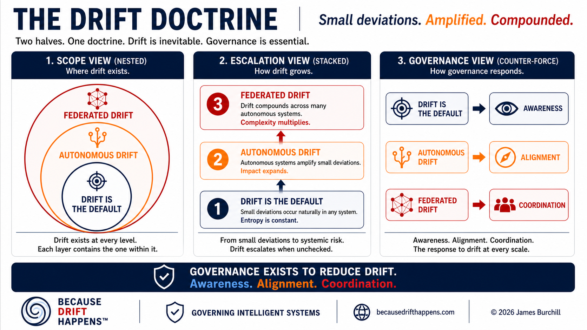
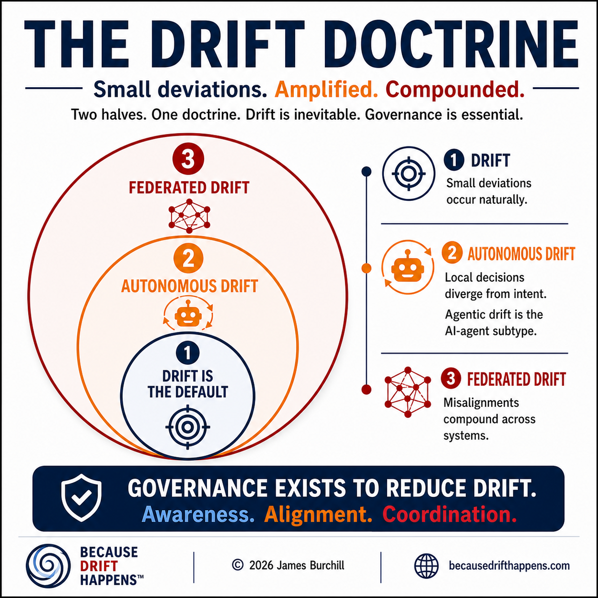

# Diagrams

This directory will hold visual models for Because Drift Happens. Diagrams should clarify doctrine, vocabulary, and architecture patterns without turning the framework into a product diagram set.

The canonical doctrine graphics should use the language in [Doctrine](../doctrine.md), especially autonomous drift as the master term and agentic drift as an AI-agent subterm.

## Canonical Doctrine Views

The current doctrine uses three visual views:

- **Scope view:** nested concentric layers showing federated drift containing autonomous drift, and autonomous drift containing drift.
- **Escalation view:** a vertical stack showing drift escalating from local deviation to autonomous divergence to federated systemic risk.
- **Governance view:** a paired response model showing awareness, alignment, and coordination as the capabilities that reveal, reduce, and contain drift.

## Current Doctrine Graphics

These generated graphics are draft visual assets for the current doctrine wording. They should be treated as publication candidates, not as editable source files.

## Expected Diagram Types

Future diagrams may include:

- Drift paths across intent, context, execution, and outcome.
- Control-plane relationships above agents and workflows.
- Governance checkpoint flow.
- Veto, hold, escalation, and rollback paths.
- Coherence boundaries in federated systems.
- Audit trail spine across tools, agents, and state changes.

## Diagram Guidelines

Diagrams should:

- Use plain labels.
- Use **Autonomous Drift** in primary doctrine graphics.
- Use **Agentic Drift** only when the graphic is specifically about AI agents or intentionally uses the term as a subterm or audience hook.
- Use the tagline **Small deviations. Amplified. Compounded.** where a tagline is needed.
- Avoid vendor-specific architecture unless clearly marked as an example.
- Show authority, feedback, and intervention paths where relevant.
- Avoid implying that the framework is complete or tied to one implementation.
- Be understandable without a long explanation.

See [placeholders.md](placeholders.md) for the initial diagram backlog.
