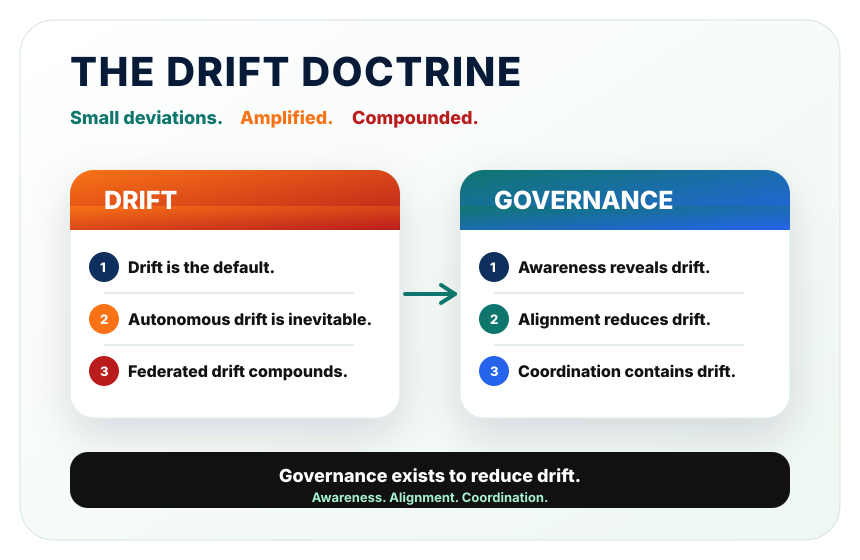

---
hide:
  - navigation
  - toc
---

<section class="bdh-hero" markdown>

# Because Drift Happens™

A doctrine for recognizing and responding when businesses and their systems drift from their original intent.

Drift is the default.
Autonomous drift is inevitable.
Federated drift compounds.

Businesses, processes, assumptions, and technology change over time. Small exceptions accumulate, context is lost, and what happens in practice can move away from what was intended. Because Drift Happens explores how we recognize that movement and respond while there is still time to influence the outcome.

The technical framework below applies this thinking to intelligent and autonomous systems. It defines vocabulary, principles, failure patterns, and architecture concepts for keeping those systems observable, accountable, and aligned as they adapt.

[Read the doctrine](doctrine.md){ .bdh-button .bdh-button--primary }
[Start with the manifesto](manifesto.md){ .bdh-button .bdh-button--secondary }

<figure class="bdh-visual" markdown>

</figure>
</section>

Autonomous systems do not remove drift. They make drift operationally consequential. The question is whether a running system can remain understandable, bounded, auditable, and open to intervention while it adapts.

## Doctrine At A Glance

<section class="bdh-doctrine-preview" markdown>

The Drift Doctrine describes two halves of the same operating reality: drift is inevitable, and governance is essential.

</section>

## Start Here

[**Doctrine** 
The canonical Drift Doctrine.](doctrine.md){ .bdh-link-card }

[**Manifesto** 
The core architectural position behind the framework.](manifesto.md){ .bdh-link-card }

[**Principles**  
The operating assumptions for governable intelligent systems.](principles.md){ .bdh-link-card }

[**Reading Map**  
A suggested path through the doctrine.](reading-map.md){ .bdh-link-card }

[**Glossary**  
The initial shared vocabulary.](glossary.md){ .bdh-link-card }

[**Failure Patterns**  
Recurring ways autonomous systems lose coherence.](failure-patterns.md){ .bdh-link-card }

[**Architecture Patterns**  
Control-plane and governance patterns for system design.](architecture-patterns.md){ .bdh-link-card }

## The Technical Framework

<ul class="bdh-compact-list">
  <li><a href="drift/">Drift</a></li>
  <li><a href="coherence/">Coherence</a></li>
  <li><a href="governance/">Governance</a></li>
  <li><a href="federation/">Federation</a></li>
  <li><a href="control-planes/">Control planes</a></li>
  <li><a href="intervention/">Intervention</a></li>
  <li><a href="observability/">Observability</a></li>
  <li><a href="examples/">Examples</a></li>
</ul>

## The Author and Related Work

Because Drift Happens is developed by [James Burchill](https://jamesburchill.com/), Business Systems Architect, CTO, and bestselling author. It informs his work connecting business priorities, systems design, and practical delivery.

- [The Vault](https://vault.jamesburchill.com/) brings together practical knowledge, essays, field notes, and resources across business and technology.
- [Driftinel](https://jamesburchill.com/driftinel/) is a drift detection system in development, applying this thinking to the business information an owner chooses to watch.
- [James’s work and engagements](https://jamesburchill.com/#engagements) span advisory, paid discovery, and separately scoped implementation.

This is not a product repository, vendor framework, compliance checklist, or finished doctrine. It is a public working framework intended to become more precise as the language, patterns, and examples are tested against real operational systems.

