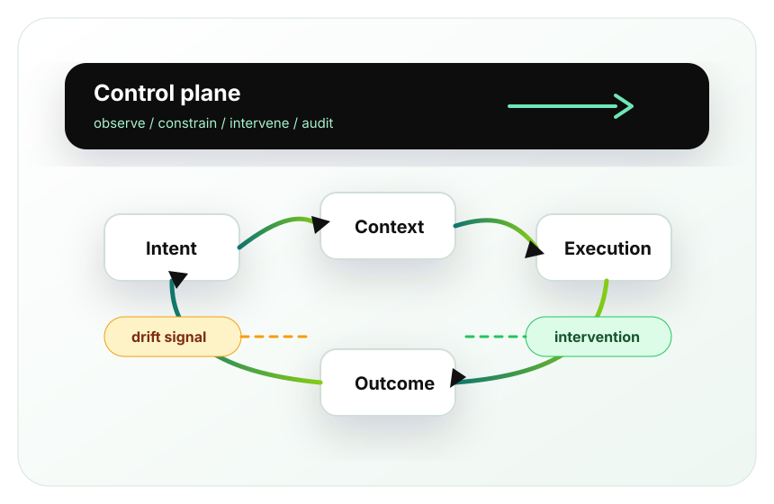

---
hide:
  - navigation
  - toc
---

<section class="bdh-hero" markdown>

# Because Drift Happens™

A doctrine for governing intelligent systems as they adapt, delegate, and drift.

Drift is the default.
Autonomous drift is inevitable.
Federated drift compounds.

Because Drift Happens is a public doctrine and reference framework for governing intelligent systems under change. It defines vocabulary, principles, failure patterns, and architecture concepts for systems that need to remain observable, accountable, governable, and aligned while they adapt.

[Start with the manifesto](manifesto.md){ .bdh-button .bdh-button--primary }
[Browse the glossary](glossary.md){ .bdh-button .bdh-button--secondary }

<figure class="bdh-visual" markdown>

</figure>
</section>

Autonomous systems do not remove drift. They make drift operationally consequential. The question is whether a running system can remain understandable, bounded, auditable, and open to intervention while it adapts.

## Start Here

[**Manifesto**  
The core architectural position behind the framework.](manifesto.md){ .bdh-link-card }

[**Doctrine**
The canonical drift and governance triplets.](doctrine.md){ .bdh-link-card }

[**Principles**  
The operating assumptions for governable intelligent systems.](principles.md){ .bdh-link-card }

[**Reading Map**  
A suggested path through the doctrine.](reading-map.md){ .bdh-link-card }

[**Glossary**  
The initial shared vocabulary.](glossary.md){ .bdh-link-card }

[**Failure Patterns**  
Recurring ways autonomous systems lose coherence.](failure-patterns.md){ .bdh-link-card }

[**Architecture Patterns**  
Control-plane and governance patterns for system design.](architecture-patterns.md){ .bdh-link-card }

## What The Framework Covers

<ul class="bdh-compact-list">
  <li><a href="drift/">Drift</a></li>
  <li><a href="coherence/">Coherence</a></li>
  <li><a href="governance/">Governance</a></li>
  <li><a href="federation/">Federation</a></li>
  <li><a href="control-planes/">Control planes</a></li>
  <li><a href="intervention/">Intervention</a></li>
  <li><a href="observability/">Observability</a></li>
  <li><a href="examples/">Examples</a></li>
</ul>

This is not a product repository, vendor framework, compliance checklist, or finished doctrine. It is a public working framework intended to become more precise as the language, patterns, and examples are tested against real operational systems.

